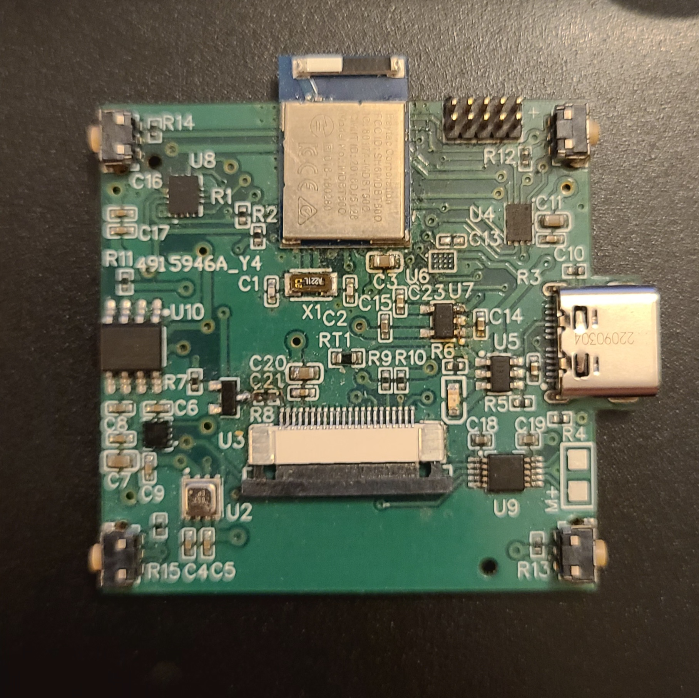

# hctaw
Average Intelligence Watch  
  
Digital Watch with various sensors and Bluetooth Low Energy. The goal of this project is to learn more hardware design. I chose to build a watch because I knew I could use sensors and other types of ICs that I haven't worked with and it seemed challenging enough for my skill level.

## Hardware

My selection of hardware started with the MCU, and then I looked around for various sensors and chose the ones that seemed interesting to me.

### MCU

I decided to use an nRF52 because I wanted to use BLE and learn a new platform. I chose the Raytac MDBT50Q-1MV2 nRF52840 module.

### Display

240*240 1.54" TFT display with a ST7789V driver

### ICs

BME689   Gas/Pressure sensor  
LIS2MDLTR  Magnetometer  
DS3231MZ+  RTC  
BMI160  IMU  
DRV2605L  Haptic Motor Driver

### Power

The battery is chargable via USB-C.  

BQ21040DBVR  Charger IC  
LC709204FXE-01TBG  Battery Monitor

## v0.0.0

I ordered the boards from JLCPCB. They did not have any nRF modules available, so I had to buy and place my own. I successfully placed the module with solder paste, a hot plate and a hot air station. This was my first time making designing a power circuit, so I wasn't sure if it was going to work. Luckily, I was able to attach the battery without anything exploding, and I was even able to charge the battery with it! Unfortunately, I made the mistake of attaching a pin on the battery monitor to the enable pin for the LDO that it was supposed to be powered from, so the pin wouldn't go high. I used a wire to attatch the enable pin to the battery, and I was able to get 3.3V on the board. The next step was hooking it up to my computer and trying to talk to it. It didn't work. I used a multimeter and found that some of the JTAG pins were shorted together. I reflowed the module (frying the battery monitor in the process), and it worked! I flashed the program I used to test the display with a devkit, but it wasnt working. I found that the series resistor I chose for the backlight was way too high, so I replaced it and I got the backlight to work. I wasn't able to dim it, so I think I chose the wrong mosfet. Using an oscilloscope, I could see that the SPI signals were very noisey. I think this was caused by the external oscillator I chose to add. I had a hard time finding good informaiton on placing the oscillator, so I think that I may have done something wrong. I2C was also not working. Finally, I found that I made the mistake of using a pull down resistor on the buttons. Although I wasn't able to start programming it, I am glad that the power circuit worked, and that several mistakes I discovered are easily fixed.  

  
For the next version, I think I am going to make the board a bit larger, so it is easier to route, and so I can add more test points and jumpers for testing.

